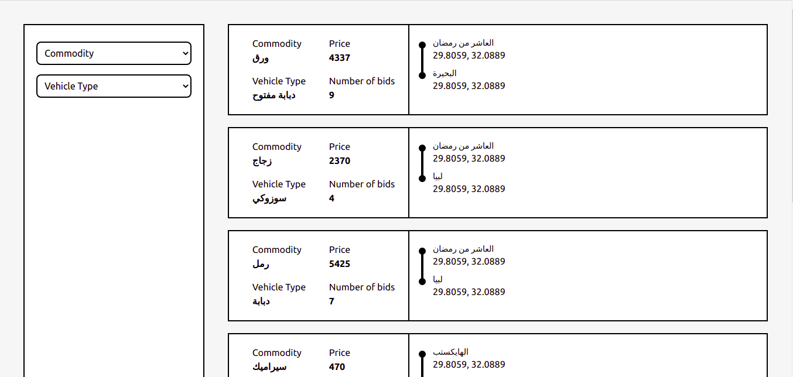
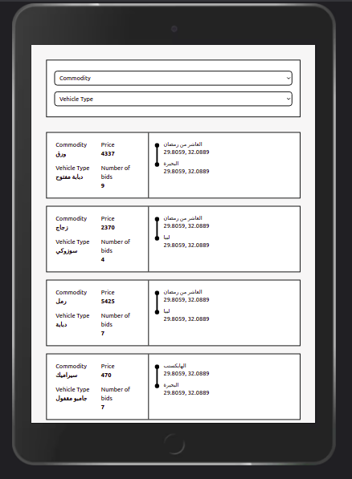
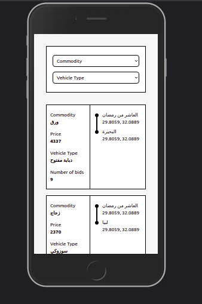

# shipping-dashboard

## Project Preview 

You can see the deployed app on github pages [here!](https://mostafa-hashhash.github.io/shipping-dashboard/)

    

## Project setup
```
yarn install
```

### Compiles and hot-reloads for development
```
yarn serve
```

### Compiles and minifies for production
```
yarn build
```

### Lints and fixes files
```
yarn lint
```

### Customize configuration
See [Configuration Reference](https://cli.vuejs.org/config/).
